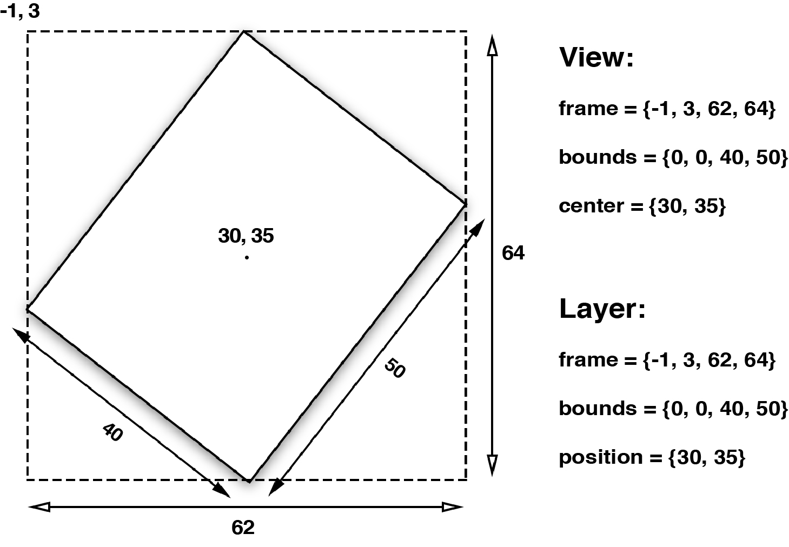
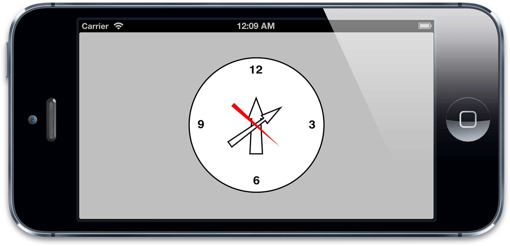
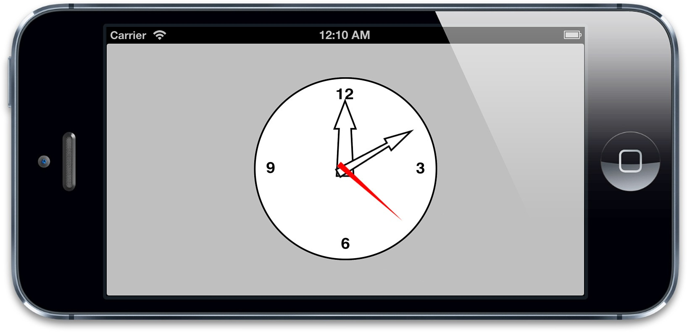
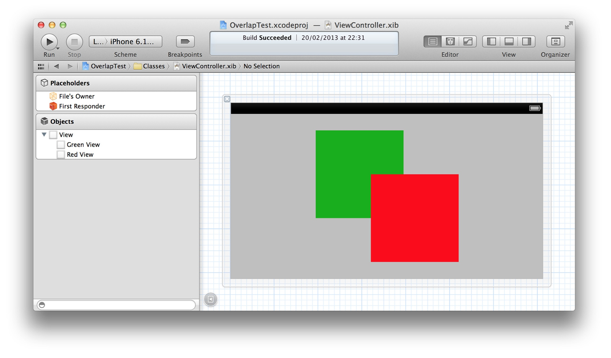

#图层几何学

在第二章里面，我们介绍了图层背后的图片，和一些控制图层坐标和旋转的属性。在这一章中，我们将要看一看图层内部是如何根据父图层和兄弟图层来控制位置和尺寸的。另外我们也会涉及如何管理图层的几何结构，以及它是如何被自动调整和自动布局影响的。

##布局
`UIView `有三个比较重要的布局属性:`frame`，`bounds`和`center`，`CALayer`对应地叫做`frame`，`bounds`和`position`。为了能清楚区分，图层用了`position`，视图用了`center`，但是他们都代表同样的值。

`frame`代表了图层的外部坐标(也就是在父图层上占据的空间)，`bounds`是内部坐标({0,0}通常是左上角)。`center`和`position`都代表了相对于父图层`anchorPoint`所在的位置。`anchorPoint`的属性将会在后续介绍到，现在把它想成图层的中心点就好了。


  视图的`frame`，`bounds`和`center`属性仅仅是存取方法，当操纵视图的`frame`，实际上是在改变位于视图下方`CALayer`的`frame`，不能够独立于图层之外改变视图的`frame`。

 记住当对图层做变换的时候，比如旋转或者缩放，frame实际上代表了覆盖在图层旋转之后的整个轴对齐的矩形区域，也就是说frame的宽高可能和bounds的宽高不再一致了。
 
 
 
 
 
##锚点
 之前提到过，视图的center属性和图层的position属性都指定了anchorPoint相对于父图层的位置。**图层的anchorPoint通过position来控制它的frame的位置，你可以认为anchorPoint是用来移动图层的把柄。**
 
 默认来说，anchorPoint位于图层的中点，所以图层的将会以这个点为中心放置。anchorPoint属性并没有被UIView接口暴露出来，这也是视图的position属性被叫做“center”的原因。但是图层的anchorPoint可以被移动，比如你可以把它置于图层frame的左上角，于是图层的内容将会向右下角的position方向移动（图3.3），而不是居中了。
 
  
  
  和第二章提到的contentsRect和contentsCenter属性类似，anchorPoint用单位坐标来描述，也就是图层的相对坐标，图层左上角是{0, 0}，右下角是{1, 1}，因此默认坐标是{0.5, 0.5}。anchorPoint可以通过指定x和y值小于0或者大于1，使它放置在图层范围之外。
  
  那在什么场合需要改变anchorPoint呢？既然我们可以随意改变图层位置，那改变anchorPoint不会造成困惑么？为了举例说明，我们来举一个实用的例子，创建一个模拟闹钟的项目。
    钟面和钟表由四张图片组成（图3.4），为了简单说明，我们还是用传统的方式来装载和加载图片，使用四个UIImageView实例（当然你也可以用正常的视图，设置他们图层的contents图片）。
    
    
```
@interface ViewController ()

@property (nonatomic, weak) IBOutlet UIImageView *hourHand;
@property (nonatomic, weak) IBOutlet UIImageView *minuteHand;
@property (nonatomic, weak) IBOutlet UIImageView *secondHand;
@property (nonatomic, weak) NSTimer *timer;

@end

@implementation ViewController

- (void)viewDidLoad
{
    [super viewDidLoad];
    //start timer
    self.timer = [NSTimer scheduledTimerWithTimeInterval:1.0 target:self selector:@selector(tick) userInfo:nil repeats:YES];
                  
    //set initial hand positions
    [self tick];
}

- (void)tick
{
    //convert time to hours, minutes and seconds
    NSCalendar *calendar = [[NSCalendar alloc] initWithCalendarIdentifier:NSGregorianCalendar];
    NSUInteger units = NSHourCalendarUnit | NSMinuteCalendarUnit | NSSecondCalendarUnit;
    NSDateComponents *components = [calendar components:units fromDate:[NSDate date]];
    CGFloat hoursAngle = (components.hour / 12.0) * M_PI * 2.0;
    //calculate hour hand angle //calculate minute hand angle
    CGFloat minsAngle = (components.minute / 60.0) * M_PI * 2.0;
    //calculate second hand angle
    CGFloat secsAngle = (components.second / 60.0) * M_PI * 2.0;
    //rotate hands
    self.hourHand.transform = CGAffineTransformMakeRotation(hoursAngle);
    self.minuteHand.transform = CGAffineTransformMakeRotation(minsAngle);
    self.secondHand.transform = CGAffineTransformMakeRotation(secsAngle);
}

@end
```

  


```
- (void)viewDidLoad 
{
    [super viewDidLoad];
    // adjust anchor points

    self.secondHand.layer.anchorPoint = CGPointMake(0.5f, 0.9f); 
    self.minuteHand.layer.anchorPoint = CGPointMake(0.5f, 0.9f); 
    self.hourHand.layer.anchorPoint = CGPointMake(0.5f, 0.9f);


    // start timer
}
```
  


##坐标系


和视图一样，图层在图层树当中也是相对于父图层按层级关系放置，一个图层的position依赖于它父图层的bounds，如果父图层发生了移动，它的所有子图层也会跟着移动。
这样对于放置图层会更加方便，因为你可以通过移动根图层来将它的子图层作为一个整体来移动，但是有时候你需要知道一个图层的绝对位置，或者是相对于另一个图层的位置，而不是它当前父图层的位置。
CALayer给不同坐标系之间的图层转换提供了一些工具类方法：
 
```
- (CGPoint)convertPoint:(CGPoint)point fromLayer:(CALayer *)layer;
- (CGPoint)convertPoint:(CGPoint)point toLayer:(CALayer *)layer;
- (CGRect)convertRect:(CGRect)rect fromLayer:(CALayer *)layer;
- (CGRect)convertRect:(CGRect)rect toLayer:(CALayer *)layer;
```
这些方法可以把定义在一个图层坐标系下的点或者矩形转换成另一个图层坐标系下的点或者矩形。

###翻转的几何结构
常规说来，在iOS上，一个图层的position位于父图层的左上角，但是在Mac OS上，通常是位于左下角。Core Animation可以通过geometryFlipped属性来适配这两种情况，它决定了一个图层的坐标是否相对于父图层垂直翻转，是一个BOOL类型。在iOS上通过设置它为YES意味着它的子图层将会被垂直翻转，也就是将会沿着底部排版而不是通常的顶部（它的所有子图层也同理，除非把它们的geometryFlipped属性也设为YES）。

###Z坐标轴

  *和UIView严格的二维坐标系不同，CALayer存在于一个三维空间当中。*除了我们已经讨论过的position和anchorPoint属性之外，CALayer还有另外两个属性，zPosition和anchorPointZ，二者都是在Z轴上描述图层位置的浮点类型。

 注意这里并没有更深的属性来描述由宽和高做成的bounds了，图层是一个完全扁平的对象，你可以把它们想象成类似于一页二维的坚硬的纸片，用胶水粘成一个空洞，就像三维结构的折纸一样。
 
*zPosition*属性在大多数情况下其实并不常用。在第五章，我们将会涉及CATransform3D，你会知道如何在三维空间移动和旋转图层，除了做变换之外，zPosition最实用的功能就是改变图层的显示顺序了。

  

```
@interface ViewController ()

@property (nonatomic, weak) IBOutlet UIView *greenView;
@property (nonatomic, weak) IBOutlet UIView *redView;

@end

@implementation ViewController

- (void)viewDidLoad
{
    [super viewDidLoad];
    
    //move the green view zPosition nearer to the camera
    self.greenView.layer.zPosition = 1.0f;
}
@end
```


##Hit Testing
第一章“图层树”证实了最好使用图层相关视图，而不是创建独立的图层关系。其中一个原因就是要处理额外复杂的触摸事件。

`CALayer`并不关心任何响应链事件，所以不能直接处理触摸事件或者手势。但是它有一系列的方法帮你处理事件：`-containsPoint:`和`-hitTest:`。


`-containsPoint:`接受一个在本图层坐标系下的CGPoint，如果这个点在图层frame范围内就返回YES。如清单3.4所示第一章的项目的另一个合适的版本，也就是使用-containsPoint:方法来判断到底是白色还是蓝色的图层被触摸了。这需要把触摸坐标转换成每个图层坐标系下的坐标，结果很不方便。

```
@interface ViewController ()

@property (nonatomic, weak) IBOutlet UIView *layerView;
@property (nonatomic, weak) CALayer *blueLayer;

@end

@implementation ViewController

- (void)viewDidLoad
{
    [super viewDidLoad];
    //create sublayer
    self.blueLayer = [CALayer layer];
    self.blueLayer.frame = CGRectMake(50.0f, 50.0f, 100.0f, 100.0f);
    self.blueLayer.backgroundColor = [UIColor blueColor].CGColor;
    //add it to our view
    [self.layerView.layer addSublayer:self.blueLayer];
}

- (void)touchesBegan:(NSSet *)touches withEvent:(UIEvent *)event
{
    //get touch position relative to main view
    CGPoint point = [[touches anyObject] locationInView:self.view];
    //convert point to the white layer's coordinates
    point = [self.layerView.layer convertPoint:point fromLayer:self.view.layer];
    //get layer using containsPoint:
    if ([self.layerView.layer containsPoint:point]) {
        //convert point to blueLayer’s coordinates
        point = [self.blueLayer convertPoint:point fromLayer:self.layerView.layer];
        if ([self.blueLayer containsPoint:point]) {
            [[[UIAlertView alloc] initWithTitle:@"Inside Blue Layer"
                                        message:nil
                                       delegate:nil
                              cancelButtonTitle:@"OK"
                              otherButtonTitles:nil] show];
        } else {
            [[[UIAlertView alloc] initWithTitle:@"Inside White Layer"
                                        message:nil
                                       delegate:nil
                              cancelButtonTitle:@"OK"
                              otherButtonTitles:nil] show];
        }
    }
}

@end
```

`-hitTest:`方法同样接受一个CGPoint类型参数，而不是BOOL类型，它返回图层本身，或者包含这个坐标点的叶子节点图层。这意味着不再需要像使用-containsPoint:那样，人工地在每个子图层变换或者测试点击的坐标。如果这个点在最外面图层的范围之外，则返回nil。

```
- (void)touchesBegan:(NSSet *)touches withEvent:(UIEvent *)event
{
    //get touch position
    CGPoint point = [[touches anyObject] locationInView:self.view];
    //get touched layer
    CALayer *layer = [self.layerView.layer hitTest:point];
    //get layer using hitTest
    if (layer == self.blueLayer) {
        [[[UIAlertView alloc] initWithTitle:@"Inside Blue Layer"
                                    message:nil
                                   delegate:nil
                          cancelButtonTitle:@"OK"
                          otherButtonTitles:nil] show];
    } else if (layer == self.layerView.layer) {
        [[[UIAlertView alloc] initWithTitle:@"Inside White Layer"
                                    message:nil
                                   delegate:nil
                          cancelButtonTitle:@"OK"
                          otherButtonTitles:nil] show];
    }
}
```
注意当调用图层的-hitTest:方法时，测算的顺序严格依赖于图层树当中的图层顺序（和UIView处理事件类似）。之前提到的zPosition属性可以明显改变屏幕上图层的顺序，但不能改变事件传递的顺序。

这意味着如果改变了图层的z轴顺序，你会发现将不能够检测到最前方的视图点击事件，这是因为被另一个图层遮盖住了，虽然它的zPosition值较小，但是在图层树中的顺序靠前。我们将在第五章详细讨论这个问题。

##自动布局
在Mac OS平台，`CALayer`有一个叫做`layoutManager`的属性可以通过`CALayoutManager`协议和`CAConstraintLayoutManager`类来实现自动排版的机制。但由于某些原因，这在iOS上并不适用。

当使用视图的时候，可以充分利用UIView类接口暴露出来的`UIViewAutoresizingMask`和`NSLayoutConstraint`API，但如果想随意控制CALayer的布局，就需要手工操作。最简单的方法就是使用CALayerDelegate如下函数：

```
- (void)layoutSublayersOfLayer:(CALayer *)layer;
```

当图层的bounds发生改变，或者图层的-setNeedsLayout方法被调用的时候，这个函数将会被执行。这使得你可以手动地重新摆放或者重新调整子图层的大小，但是不能像UIView的autoresizingMask和constraints属性做到自适应屏幕旋转。

这也是为什么最好使用视图而不是单独的图层来构建应用程序的另一个重要原因之一。