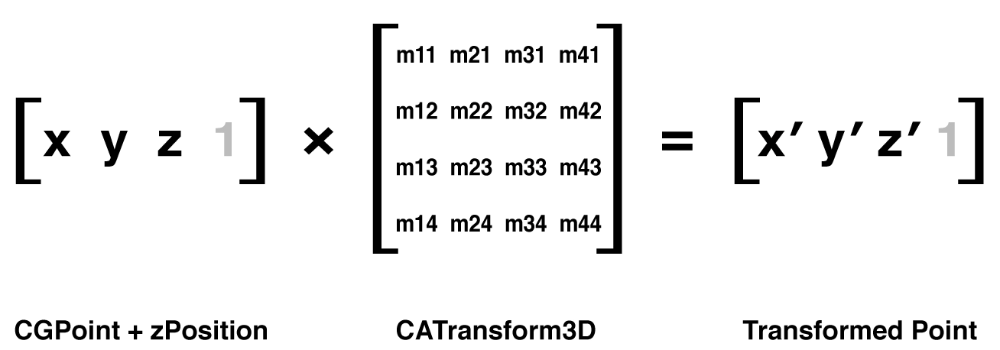

#变换
在第四章“可视效果”中，我们研究了一些增强图层和它的内容显示效果的一些技术，在这一章中，我们将要研究可以用来对图层旋转，摆放或者扭曲的CGAffineTransform，以及可以将扁平物体转换成三维空间对象的CATransform3D（而不是仅仅对圆角矩形添加下沉阴影）。

##仿射变换

在第三章“图层几何学”中，我们使用了UIView的transform属性旋转了钟的指针，但并没有解释背后运作的原理，实际上UIView的transform属性是一个CGAffineTransform类型，用于在二维空间做旋转，缩放和平移。CGAffineTransform是一个可以和二维空间向量（例如CGPoint）做乘法的3X2的矩阵。


用CGPoint的每一列和CGAffineTransform矩阵的每一行对应元素相乘再求和，就形成了一个新的CGPoint类型的结果。要解释一下图中显示的灰色元素，为了能让矩阵做乘法，左边矩阵的列数一定要和右边矩阵的行数个数相同，所以要给矩阵填充一些标志值，使得既可以让矩阵做乘法，又不改变运算结果，并且没必要存储这些添加的值，因为它们的值不会发生变化，但是要用来做运算。

当对图层应用变换矩阵，图层矩形内的每一个点都被相应地做变换，从而形成一个新的四边形的形状。CGAffineTransform中的“仿射”的意思是无论变换矩阵用什么值，图层中平行的两条线在变换之后任然保持平行，CGAffineTransform可以做出任意符合上述标注的变换，图5.2显示了一些仿射的和非仿射的变换：


###创建一个`CGAffineTransform`
不过如果你对矩阵完全不熟悉的话，矩阵变换可能会使你感到畏惧。幸运的是，Core Graphics提供了一系列函数，对完全没有数学基础的开发者也能够简单地做一些变换。如下几个函数都创建了一个CGAffineTransform实例：

```
CGAffineTransformMakeRotation(CGFloat angle)
CGAffineTransformMakeScale(CGFloat sx, CGFloat sy)
CGAffineTransformMakeTranslation(CGFloat tx, CGFloat ty)
```

##3D变换
CG的前缀告诉我们，CGAffineTransform类型属于Core Graphics框架，Core Graphics实际上是一个严格意义上的2D绘图API，并且CGAffineTransform仅仅对2D变换有效。+

在第三章中，我们提到了zPosition属性，可以用来让图层靠近或者远离相机（用户视角），transform属性（CATransform3D类型）可以真正做到这点，即让图层在3D空间内移动或者旋转。
和CGAffineTransform类似，CATransform3D也是一个矩阵，但是和2x3的矩阵不同，CATransform3D是一个可以在3维空间内做变换的4x4的矩阵。



和CGAffineTransform矩阵类似，Core Animation提供了一系列的方法用来创建和组合CATransform3D类型的矩阵，和Core Graphics的函数类似，但是3D的平移和旋转多处了一个z参数，并且旋转函数除了angle之外多出了x,y,z三个参数，分别决定了每个坐标轴方向上的旋转：

```
CATransform3DMakeRotation(CGFloat angle, CGFloat x, CGFloat y, CGFloat z)
CATransform3DMakeScale(CGFloat sx, CGFloat sy, CGFloat sz) 
CATransform3DMakeTranslation(Gloat tx, CGFloat ty, CGFloat tz)
```

##固体对象

现在你懂得了在3D空间的一些图层布局的基础，我们来试着创建一个固态的3D对象（实际上是一个技术上所谓的空洞对象，但它以固态呈现）。我们用六个独立的视图来构建一个立方体的各个面。

```
@interface ViewController ()

@property (nonatomic, weak) IBOutlet UIView *containerView;
@property (nonatomic, strong) IBOutletCollection(UIView) NSArray *faces;

@end

@implementation ViewController

- (void)addFace:(NSInteger)index withTransform:(CATransform3D)transform
{
    //get the face view and add it to the container
    UIView *face = self.faces[index];
    [self.containerView addSubview:face];
    //center the face view within the container
    CGSize containerSize = self.containerView.bounds.size;
    face.center = CGPointMake(containerSize.width / 2.0, containerSize.height / 2.0);
    // apply the transform
    face.layer.transform = transform;
}

- (void)viewDidLoad
{
    [super viewDidLoad];
    //set up the container sublayer transform
    CATransform3D perspective = CATransform3DIdentity;
    perspective.m34 = -1.0 / 500.0;
    self.containerView.layer.sublayerTransform = perspective;
    //add cube face 1
    CATransform3D transform = CATransform3DMakeTranslation(0, 0, 100);
    [self addFace:0 withTransform:transform];
    //add cube face 2
    transform = CATransform3DMakeTranslation(100, 0, 0);
    transform = CATransform3DRotate(transform, M_PI_2, 0, 1, 0);
    [self addFace:1 withTransform:transform];
    //add cube face 3
    transform = CATransform3DMakeTranslation(0, -100, 0);
    transform = CATransform3DRotate(transform, M_PI_2, 1, 0, 0);
    [self addFace:2 withTransform:transform];
    //add cube face 4
    transform = CATransform3DMakeTranslation(0, 100, 0);
    transform = CATransform3DRotate(transform, -M_PI_2, 1, 0, 0);
    [self addFace:3 withTransform:transform];
    //add cube face 5
    transform = CATransform3DMakeTranslation(-100, 0, 0);
    transform = CATransform3DRotate(transform, -M_PI_2, 0, 1, 0);
    [self addFace:4 withTransform:transform];
    //add cube face 6
    transform = CATransform3DMakeTranslation(0, 0, -100);
    transform = CATransform3DRotate(transform, M_PI, 0, 1, 0);
    [self addFace:5 withTransform:transform];
}

@end
```


从这个角度看立方体并不是很明显；看起来只是一个方块，为了更好地欣赏它，我们将更换一个不同的视角。
旋转这个立方体将会显得很笨重，因为我们要单独对每个面做旋转。另一个简单的方案是通过调整容器视图的sublayerTransform去旋转照相机。
添加如下几行去旋转containerView图层的perspective变换矩阵：

```
perspective = CATransform3DRotate(perspective, -M_PI_4, 1, 0, 0); 
perspective = CATransform3DRotate(perspective, -M_PI_4, 0, 1, 0);
```


##光亮和阴影

现在它看起来更像是一个立方体没错了，但是对每个面之间的连接还是很难分辨。Core Animation可以用3D显示图层，但是它对光线并没有概念。如果想让立方体看起来更加真实，需要自己做一个阴影效果。你可以通过改变每个面的背景颜色或者直接用带光亮效果的图片来调整。
如果需要动态地创建光线效果，你可以根据每个视图的方向应用不同的alpha值做出半透明的阴影图层，但为了计算阴影图层的不透明度，你需要得到每个面的正太向量（垂直于表面的向量），然后根据一个想象的光源计算出两个向量叉乘结果。叉乘代表了光源和图层之间的角度，从而决定了它有多大程度上的光亮。

**我们用GLKit框架来做向量的计算（你需要引入GLKit库来运行代码），每个面的CATransform3D都被转换成GLKMatrix4，然后通过GLKMatrix4GetMatrix3函数得出一个3×3的旋转矩阵。这个旋转矩阵指定了图层的方向，然后可以用它来得到正太向量的值。**

结果如图所示，试着调整LIGHT_DIRECTION和AMBIENT_LIGHT的值来切换光线效果

```
#import "ViewController.h" 
#import  
#import 

#define LIGHT_DIRECTION 0, 1, -0.5 
#define AMBIENT_LIGHT 0.5

@interface ViewController ()

@property (nonatomic, weak) IBOutlet UIView *containerView;
@property (nonatomic, strong) IBOutletCollection(UIView) NSArray *faces;

@end

@implementation ViewController

- (void)applyLightingToFace:(CALayer *)face
{
    //add lighting layer
    CALayer *layer = [CALayer layer];
    layer.frame = face.bounds;
    [face addSublayer:layer];
    //convert the face transform to matrix
    //(GLKMatrix4 has the same structure as CATransform3D)
    //译者注：GLKMatrix4和CATransform3D内存结构一致，但坐标类型有长度区别，所以理论上应该做一次float到CGFloat的转换，感谢[@zihuyishi](https://github.com/zihuyishi)同学~
    CATransform3D transform = face.transform;
    GLKMatrix4 matrix4 = *(GLKMatrix4 *)&transform;
    GLKMatrix3 matrix3 = GLKMatrix4GetMatrix3(matrix4);
    //get face normal
    GLKVector3 normal = GLKVector3Make(0, 0, 1);
    normal = GLKMatrix3MultiplyVector3(matrix3, normal);
    normal = GLKVector3Normalize(normal);
    //get dot product with light direction
    GLKVector3 light = GLKVector3Normalize(GLKVector3Make(LIGHT_DIRECTION));
    float dotProduct = GLKVector3DotProduct(light, normal);
    //set lighting layer opacity
    CGFloat shadow = 1 + dotProduct - AMBIENT_LIGHT;
    UIColor *color = [UIColor colorWithWhite:0 alpha:shadow];
    layer.backgroundColor = color.CGColor;
}

- (void)addFace:(NSInteger)index withTransform:(CATransform3D)transform
{
    //get the face view and add it to the container
    UIView *face = self.faces[index];
    [self.containerView addSubview:face];
    //center the face view within the container
    CGSize containerSize = self.containerView.bounds.size;
    face.center = CGPointMake(containerSize.width / 2.0, containerSize.height / 2.0);
    // apply the transform
    face.layer.transform = transform;
    //apply lighting
    [self applyLightingToFace:face.layer];
}

- (void)viewDidLoad
{
    [super viewDidLoad];
    //set up the container sublayer transform
    CATransform3D perspective = CATransform3DIdentity;
    perspective.m34 = -1.0 / 500.0;
    perspective = CATransform3DRotate(perspective, -M_PI_4, 1, 0, 0);
    perspective = CATransform3DRotate(perspective, -M_PI_4, 0, 1, 0);
    self.containerView.layer.sublayerTransform = perspective;
    //add cube face 1
    CATransform3D transform = CATransform3DMakeTranslation(0, 0, 100);
    [self addFace:0 withTransform:transform];
    //add cube face 2
    transform = CATransform3DMakeTranslation(100, 0, 0);
    transform = CATransform3DRotate(transform, M_PI_2, 0, 1, 0);
    [self addFace:1 withTransform:transform];
    //add cube face 3
    transform = CATransform3DMakeTranslation(0, -100, 0);
    transform = CATransform3DRotate(transform, M_PI_2, 1, 0, 0);
    [self addFace:2 withTransform:transform];
    //add cube face 4
    transform = CATransform3DMakeTranslation(0, 100, 0);
    transform = CATransform3DRotate(transform, -M_PI_2, 1, 0, 0);
    [self addFace:3 withTransform:transform];
    //add cube face 5
    transform = CATransform3DMakeTranslation(-100, 0, 0);
    transform = CATransform3DRotate(transform, -M_PI_2, 0, 1, 0);
    [self addFace:4 withTransform:transform];
    //add cube face 6
    transform = CATransform3DMakeTranslation(0, 0, -100);
    transform = CATransform3DRotate(transform, M_PI, 0, 1, 0);
    [self addFace:5 withTransform:transform];
}

@end
```


###点击事件
你应该能注意到现在可以在第三个表面的顶部看见按钮了，点击它，什么都没发生，为什么呢？
这并不是因为iOS在3D场景下正确地处理响应事件，实际上是可以做到的。问题在于视图顺序。在第三章中我们简要提到过，**点击事件的处理由视图在父视图中的顺序决定的，并不是3D空间中的Z轴顺序。当给立方体添加视图的时候，我们实际上是按照一个顺序添加，所以按照视图/图层顺序来说，4，5，6在3的前面。**

即使我们看不见4，5，6的表面（因为被1，2，3遮住了），iOS在事件响应上仍然保持之前的顺序。当试图点击表面3上的按钮，表面4，5，6截断了点击事件（取决于点击的位置），这就和普通的2D布局在按钮上覆盖物体一样。
你也许认为把doubleSided设置成NO可以解决这个问题，因为它不再渲染视图后面的内容，但实际上并不起作用。因为背对相机而隐藏的视图仍然会响应点击事件（这和通过设置hidden属性或者设置alpha为0而隐藏的视图不同，那两种方式将不会响应事件）。所以即使禁止了双面渲染仍然不能解决这个问题（虽然由于性能问题，还是需要把它设置成NO）。


