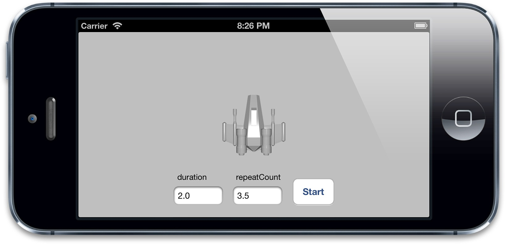
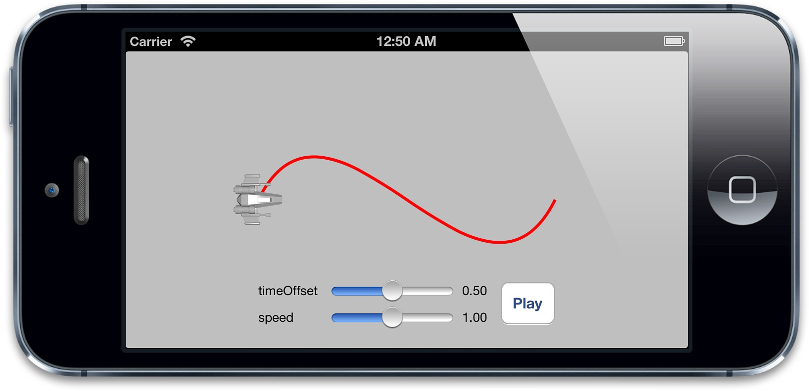

# 图层时间

`时间和空间最大的区别在于，时间不能被复用 -- 弗斯特梅里克`

在上面两章中，我们探讨了可以用CAAnimation和它的子类实现的多种图层动画。动画的发生是需要持续一段时间的，所以计时对整个概念来说至关重要。在这一章中，我们来看看CAMediaTiming，看看Core Animation是如何跟踪时间的。

##`CAMediaTiming `协议
CAMediaTiming协议定义了在一段动画内用来控制逝去时间的属性的集合，CALayer和CAAnimation都实现了这个协议，所以时间可以被任意基于一个图层或者一段动画的类控制。

###持续和重复

我们在第八章“显式动画”中简单提到过duration（CAMediaTiming的属性之一），duration是一个CFTimeInterval的类型（类似于NSTimeInterval的一种双精度浮点类型），对将要进行的动画的一次迭代指定了时间。

这里的一次迭代是什么意思呢？CAMediaTiming另外还有一个属性叫做repeatCount，代表动画重复的迭代次数。如果duration是2，repeatCount设为3.5（三个半迭代），那么完整的动画时长将是7秒。
duration和repeatCount默认都是0。但这不意味着动画时长为0秒，或者0次，这里的0仅仅代表了“默认”，也就是0.25秒和1次，你可以用一个简单的测试来尝试为这两个属性赋多个值，如清单9.1，图9.1展示了程序的结果。

```
@interface ViewController ()

@property (nonatomic, weak) IBOutlet UIView *containerView;
@property (nonatomic, weak) IBOutlet UITextField *durationField;
@property (nonatomic, weak) IBOutlet UITextField *repeatField;
@property (nonatomic, weak) IBOutlet UIButton *startButton;
@property (nonatomic, strong) CALayer *shipLayer;

@end

@implementation ViewController

- (void)viewDidLoad
{
    [super viewDidLoad];
    //add the ship
    self.shipLayer = [CALayer layer];
    self.shipLayer.frame = CGRectMake(0, 0, 128, 128);
    self.shipLayer.position = CGPointMake(150, 150);
    self.shipLayer.contents = (__bridge id)[UIImage imageNamed: @"Ship.png"].CGImage;
    [self.containerView.layer addSublayer:self.shipLayer];
}

- (void)setControlsEnabled:(BOOL)enabled
{
    for (UIControl *control in @[self.durationField, self.repeatField, self.startButton]) {
        control.enabled = enabled;
        control.alpha = enabled? 1.0f: 0.25f;
    }
}

- (IBAction)hideKeyboard
{
    [self.durationField resignFirstResponder];
    [self.repeatField resignFirstResponder];
}

- (IBAction)start
{
    CFTimeInterval duration = [self.durationField.text doubleValue];
    float repeatCount = [self.repeatField.text floatValue];
    //animate the ship rotation
    CABasicAnimation *animation = [CABasicAnimation animation];
    animation.keyPath = @"transform.rotation";
    animation.duration = duration;
    animation.repeatCount = repeatCount;
    animation.byValue = @(M_PI * 2);
    animation.delegate = self;
    [self.shipLayer addAnimation:animation forKey:@"rotateAnimation"];
    //disable controls
    [self setControlsEnabled:NO];
}

- (void)animationDidStop:(CAAnimation *)anim finished:(BOOL)flag
{
    //reenable controls
    [self setControlsEnabled:YES];
}

@end
```



###相对时间

每次讨论到Core Animation，时间都是相对的，每个动画都有它自己描述的时间，可以独立地加速，延时或者偏移。

beginTime指定了动画开始之前的的延迟时间。这里的延迟从动画添加到可见图层的那一刻开始测量，默认是0（就是说动画会立刻执行）。
speed是一个时间的倍数，默认1.0，减少它会减慢图层/动画的时间，增加它会加快速度。如果2.0的速度，那么对于一个duration为1的动画，实际上在0.5秒的时候就已经完成了。

timeOffset和beginTime类似，但是和增加beginTime导致的延迟动画不同，增加timeOffset只是让动画快进到某一点，例如，对于一个持续1秒的动画来说，设置timeOffset为0.5意味着动画将从一半的地方开始。
和beginTime不同的是，timeOffset并不受speed的影响。所以如果你把speed设为2.0，把timeOffset设置为0.5，那么你的动画将从动画最后结束的地方开始，因为1秒的动画实际上被缩短到了0.5秒。然而即使使用了timeOffset让动画从结束的地方开始，它仍然播放了一个完整的时长，这个动画仅仅是循环了一圈，然后从头开始播放。

```
@interface ViewController ()

@property (nonatomic, weak) IBOutlet UIView *containerView;
@property (nonatomic, weak) IBOutlet UILabel *speedLabel;
@property (nonatomic, weak) IBOutlet UILabel *timeOffsetLabel;
@property (nonatomic, weak) IBOutlet UISlider *speedSlider;
@property (nonatomic, weak) IBOutlet UISlider *timeOffsetSlider;
@property (nonatomic, strong) UIBezierPath *bezierPath;
@property (nonatomic, strong) CALayer *shipLayer;

@end

@implementation ViewController

- (void)viewDidLoad
{
    [super viewDidLoad];
    //create a path
    self.bezierPath = [[UIBezierPath alloc] init];
    [self.bezierPath moveToPoint:CGPointMake(0, 150)];
    [self.bezierPath addCurveToPoint:CGPointMake(300, 150) controlPoint1:CGPointMake(75, 0) controlPoint2:CGPointMake(225, 300)];
    //draw the path using a CAShapeLayer
    CAShapeLayer *pathLayer = [CAShapeLayer layer];
    pathLayer.path = self.bezierPath.CGPath;
    pathLayer.fillColor = [UIColor clearColor].CGColor;
    pathLayer.strokeColor = [UIColor redColor].CGColor;
    pathLayer.lineWidth = 3.0f;
    [self.containerView.layer addSublayer:pathLayer];
    //add the ship
    self.shipLayer = [CALayer layer];
    self.shipLayer.frame = CGRectMake(0, 0, 64, 64);
    self.shipLayer.position = CGPointMake(0, 150);
    self.shipLayer.contents = (__bridge id)[UIImage imageNamed: @"Ship.png"].CGImage;
    [self.containerView.layer addSublayer:self.shipLayer];
    //set initial values
    [self updateSliders];
}

- (IBAction)updateSliders
{
    CFTimeInterval timeOffset = self.timeOffsetSlider.value;
    self.timeOffsetLabel.text = [NSString stringWithFormat:@"%0.2f", timeOffset];
    float speed = self.speedSlider.value;
    self.speedLabel.text = [NSString stringWithFormat:@"%0.2f", speed];
}

- (IBAction)play
{
    //create the keyframe animation
    CAKeyframeAnimation *animation = [CAKeyframeAnimation animation];
    animation.keyPath = @"position";
    animation.timeOffset = self.timeOffsetSlider.value;
    animation.speed = self.speedSlider.value;
    animation.duration = 1.0;
    animation.path = self.bezierPath.CGPath;
    animation.rotationMode = kCAAnimationRotateAuto;
    animation.removedOnCompletion = NO;
    [self.shipLayer addAnimation:animation forKey:@"slide"];
}

@end
```



###fillMode

对于beginTime非0的一段动画来说，会出现一个当动画添加到图层上但什么也没发生的状态。类似的，removeOnCompletion被设置为NO的动画将会在动画结束的时候仍然保持之前的状态。这就产生了一个问题，当动画开始之前和动画结束之后，被设置动画的属性将会是什么值呢？
一种可能是属性和动画没被添加之前保持一致，也就是在模型图层定义的值（见第七章“隐式动画”，模型图层和呈现图层的解释）。
另一种可能是保持动画开始之前那一帧，或者动画结束之后的那一帧。这就是所谓的填充，因为动画开始和结束的值用来填充开始之前和结束之后的时间。+

这种行为就交给开发者了，它可以被CAMediaTiming的fillMode来控制。fillMode是一个NSString类型，可以接受如下四种常量：

```
kCAFillModeForwards 
kCAFillModeBackwards 
kCAFillModeBoth 
kCAFillModeRemoved
```
 默认是kCAFillModeRemoved，当动画不再播放的时候就显示图层模型指定的值剩下的三种类型向前，向后或者即向前又向后去填充动画状态，使得动画在开始前或者结束后仍然保持开始和结束那一刻的值。但是记住了，当用它来解决这个问题的时候，需要把removeOnCompletion设置为NO，另外需要给动画添加一个非空的键，于是可以在不需要动画的时候把它从图层上移除。


##层级关系时间

在“图层几何学”中，你已经了解到每个图层是如何相对在图层树中的父图层定义它的坐标系的。动画时间和它类似，**每个动画和图层在时间上都有它自己的层级概念，相对于它的父亲来测量。**对图层调整时间将会影响到它本身和子图层的动画，但不会影响到父图层。另一个相似点是所有的动画都被按照层级组合（使用CAAnimationGroup实例）。

对CALayer或者CAGroupAnimation调整duration和repeatCount/repeatDuration属性并不会影响到子动画。但是beginTime，timeOffset和speed属性将会影响到子动画。然而在层级关系中，beginTime指定了父图层开始动画（或者组合关系中的父动画）和对象将要开始自己动画之间的偏移。类似的，调整CALayer和CAGroupAnimation的speed属性将会对动画以及子动画速度应用一个缩放的因子。

###全局时间和本地时间

CoreAnimation有一个全局时间的概念，也就是所谓的马赫时间（“马赫”实际上是iOS和Mac OS系统内核的命名）。马赫时间在设备上所有进程都是全局的--但是在不同设备上并不是全局的--不过这已经足够对动画的参考点提供便利了，你可以使用CACurrentMediaTime函数来访问马赫时间：

`CFTimeInterval time = CACurrentMediaTime();`

这个函数返回的值其实无关紧要（它返回了设备自从上次启动后的秒数，并不是你所关心的），它真实的作用在于对动画的时间测量提供了一个相对值。注意当设备休眠的时候马赫时间会暂停，也就是所有的CAAnimations（基于马赫时间）同样也会暂停。

因此马赫时间对长时间测量并不有用。比如用CACurrentMediaTime去更新一个实时闹钟并不明智。（可以用[NSDate date]代替，就像第三章例子所示）。


*每个CALayer和CAAnimation实例都有自己本地时间的概念，是根据父图层/动画层级关系中的beginTime，timeOffset和speed属性计算。*就和转换不同图层之间坐标关系一样，CALayer同样也提供了方法来转换不同图层之间的本地时间。如下：

```
- (CFTimeInterval)convertTime:(CFTimeInterval)t fromLayer:(CALayer *)l; 
- (CFTimeInterval)convertTime:(CFTimeInterval)t toLayer:(CALayer *)l;
```

当用来同步不同图层之间有不同的speed，timeOffset和beginTime的动画，这些方法会很有用。

###暂停，倒回和快进

设置动画的speed属性为0可以暂停动画，但在动画被添加到图层之后不太可能再修改它了，所以不能对正在进行的动画使用这个属性。给图层添加一个CAAnimation实际上是给动画对象做了一个不可改变的拷贝，所以对原始动画对象属性的改变对真实的动画并没有作用。相反，直接用-animationForKey:来检索图层正在进行的动画可以返回正确的动画对象，但是修改它的属性将会抛出异常。

如果移除图层正在进行的动画，图层将会急速返回动画之前的状态。但如果在动画移除之前拷贝呈现图层到模型图层，动画将会看起来暂停在那里。但是不好的地方在于之后就不能再恢复动画了。

一个简单的方法是可以利用CAMediaTiming来暂停图层本身。如果把图层的speed设置成0，它会暂停任何添加到图层上的动画。类似的，设置speed大于1.0将会快进，设置成一个负值将会倒回动画。

通过增加主窗口图层的speed，可以暂停整个应用程序的动画。这对UI自动化提供了好处，我们可以加速所有的视图动画来进行自动化测试（注意对于在主窗口之外的视图并不会被影响，比如UIAlertview）。可以在app delegate设置如下进行验证：

```
self.window.layer.speed = 100;
```

你也可以通过这种方式来减速，但其实也可以在模拟器通过切换慢速动画来实现。

##手动动画


**timeOffset一个很有用的功能在于你可以它可以让你手动控制动画进程，通过设置speed为0，可以禁用动画的自动播放，然后来使用timeOffset来来回显示动画序列。这可以使得运用手势来手动控制动画变得很简单。**

举个简单的例子：还是之前关门的动画，修改代码来用手势控制动画。我们给视图添加一个UIPanGestureRecognizer，然后用timeOffset左右摇晃。

因为在动画添加到图层之后不能再做修改了，我们来通过调整layer的timeOffset达到同样的效果。

```
@interface ViewController ()

@property (nonatomic, weak) UIView *containerView;
@property (nonatomic, strong) CALayer *doorLayer;

@end

@implementation ViewController

- (void)viewDidLoad
{
    [super viewDidLoad];
    //add the door
    self.doorLayer = [CALayer layer];
    self.doorLayer.frame = CGRectMake(0, 0, 128, 256);
    self.doorLayer.position = CGPointMake(150 - 64, 150);
    self.doorLayer.anchorPoint = CGPointMake(0, 0.5);
    self.doorLayer.contents = (__bridge id)[UIImage imageNamed:@"Door.png"].CGImage;
    [self.containerView.layer addSublayer:self.doorLayer];
    //apply perspective transform
    CATransform3D perspective = CATransform3DIdentity;
    perspective.m34 = -1.0 / 500.0;
    self.containerView.layer.sublayerTransform = perspective;
    //add pan gesture recognizer to handle swipes
    UIPanGestureRecognizer *pan = [[UIPanGestureRecognizer alloc] init];
    [pan addTarget:self action:@selector(pan:)];
    [self.view addGestureRecognizer:pan];
    //pause all layer animations
    self.doorLayer.speed = 0.0;
    //apply swinging animation (which won't play because layer is paused)
    CABasicAnimation *animation = [CABasicAnimation animation];
    animation.keyPath = @"transform.rotation.y";
    animation.toValue = @(-M_PI_2);
    animation.duration = 1.0;
    [self.doorLayer addAnimation:animation forKey:nil];
}

- (void)pan:(UIPanGestureRecognizer *)pan
{
    //get horizontal component of pan gesture
    CGFloat x = [pan translationInView:self.view].x;
    //convert from points to animation duration //using a reasonable scale factor
    x /= 200.0f;
    //update timeOffset and clamp result
    CFTimeInterval timeOffset = self.doorLayer.timeOffset;
    timeOffset = MIN(0.999, MAX(0.0, timeOffset - x));
    self.doorLayer.timeOffset = timeOffset;
    //reset pan gesture
    [pan setTranslation:CGPointZero inView:self.view];
}

@end
```

这其实是个小诡计，也许相对于设置个动画然后每次显示一帧而言，用移动手势来直接设置门的transform会更简单。

在这个例子中的确是这样，但是对于比如说关键这这样更加复杂的情况，或者有多个图层的动画组，相对于实时计算每个图层的属性而言，这就显得方便的多了。