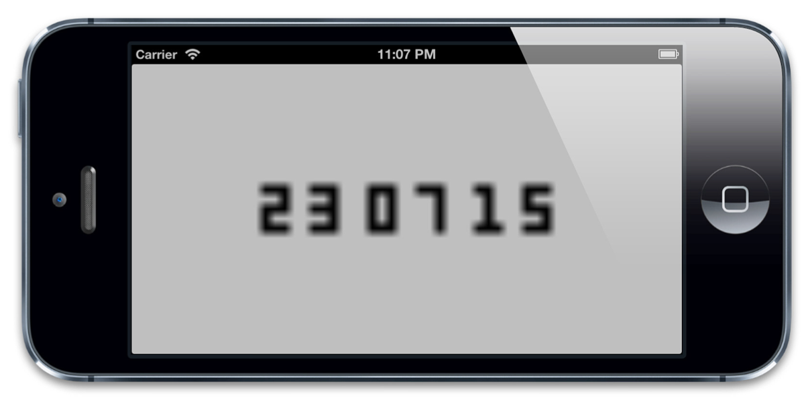
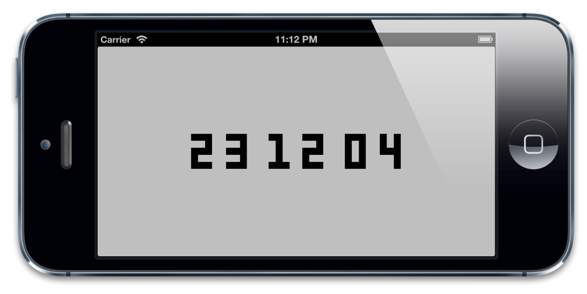

#视觉效果
  我们在第三章『图层几何学』中讨论了图层的frame，第二章『寄宿图』则讨论了图层的寄宿图。但是图层不仅仅可以是图片或是颜色的容器；还有一系列内建的特性使得创造美丽优雅的令人深刻的界面元素成为可能。在这一章，我们将会探索一些能够通过使用CALayer属性实现的视觉效果。

##圆角

圆角矩形是iOS的一个标志性审美特性。这在iOS的每一个地方都得到了体现，不论是主屏幕图标，还是警告弹框，甚至是文本框。按照这流行程度，你可能会认为一定有不借助Photoshop就能轻易创建圆角举行的方法。恭喜你，猜对了。

` CALayer`有一个叫做`conrnerRadius`的属性控制着图层角的曲率。它是一个浮点数，默认为0（为0的时候就是直角），但是你可以把它设置成任意值。默认情况下，这个曲率值只影响背景颜色而不影响背景图片或是子图层。不过，如果把`masksToBounds`设置成YES的话，图层里面的所有东西都会被截取。

##图层边框
CALayer另外两个非常有用属性就是`borderWidth`和`borderColor`。二者共同定义了图层边的绘制样式。这条线（也被称作stroke）沿着图层的bounds绘制，同时也包含图层的角。

`borderWidth`是以点为单位的定义边框粗细的浮点数，默认为0。`borderColor`定义了边框的颜色，默认为黑色。

`borderColor`是`CGColorRef`类型，而不是UIColor，所以它不是Cocoa的内置对象。不过呢，你肯定也清楚图层引用了borderColor，虽然属性声明并不能证明这一点。CGColorRef在引用/释放时候的行为表现得与NSObject极其相似。但是Objective-C语法并不支持这一做法，所以CGColorRef属性即便是强引用也只能通过assign关键字来声明。

##阴影

iOS的另一个常见特性呢，就是阴影。阴影往往可以达到图层深度暗示的效果。也能够用来强调正在显示的图层和优先级（比如说一个在其他视图之前的弹出框），不过有时候他们只是单纯的装饰目的。

  给`shadowOpacity`属性一个大于默认值（也就是0）的值，阴影就可以显示在任意图层之下。**`shadowOpacity`是一个必须在0.0（不可见）和1.0（完全不透明）之间的浮点数。如果设置为1.0，将会显示一个有轻微模糊的黑色阴影稍微在图层之上。**若要改动阴影的表现，你可以使用CALayer的另外三个属性：`shadowColor`，`shadowOffset`和`shadowRadius`。
  
显而易见，**`shadowColor`属性控制着阴影的颜色**，和`borderColor`和`backgroundColor`一样，它的类型也是`CGColorRef`。阴影默认是黑色，大多数时候你需要的阴影也是黑色的（其他颜色的阴影看起来是不是有一点点奇怪。。）

**shadowOffset属性控制着阴影的方向和距离。**它是一个CGSize的值，宽度控制这阴影横向的位移，高度控制着纵向的位移。shadowOffset的默认值是 {0, -3}，意即阴影相对于Y轴有3个点的向上位移。


**shadowRadius属性控制着阴影的模糊度**，当它的值是0的时候，阴影就和视图一样有一个非常确定的边界线。当值越来越大的时候，边界线看上去就会越来越模糊和自然。苹果自家的应用设计更偏向于自然的阴影，所以一个非零值再合适不过了。

###shadowPath属性
我们已经知道图层阴影并不总是方的，而是从图层内容的形状继承而来。这看上去不错，但是实时计算阴影也是一个非常消耗资源的，尤其是图层有多个子图层，每个图层还有一个有透明效果的寄宿图的时候。

   如果你事先知道你的阴影形状会是什么样子的，你可以通过指定一个shadowPath来提高性能。shadowPath是一个CGPathRef类型（一个指向CGPath的指针）。CGPath是一个Core Graphics对象，用来指定任意的一个矢量图形。我们可以通过这个属性单独于图层形状之外指定阴影的形状。
   
```
@interface ViewController ()

@property (nonatomic, weak) IBOutlet UIView *layerView1;
@property (nonatomic, weak) IBOutlet UIView *layerView2;
@end

@implementation ViewController

- (void)viewDidLoad
{
  [super viewDidLoad];

  //enable layer shadows
  self.layerView1.layer.shadowOpacity = 0.5f;
  self.layerView2.layer.shadowOpacity = 0.5f;

  //create a square shadow
  CGMutablePathRef squarePath = CGPathCreateMutable();
  CGPathAddRect(squarePath, NULL, self.layerView1.bounds);
  self.layerView1.layer.shadowPath = squarePath; CGPathRelease(squarePath);

  //create a circular shadow
  CGMutablePathRef circlePath = CGPathCreateMutable();
  CGPathAddEllipseInRect(circlePath, NULL, self.layerView2.bounds);
  self.layerView2.layer.shadowPath = circlePath; CGPathRelease(circlePath);
}
@end
```

##图层蒙板

 通过masksToBounds属性，我们可以沿边界裁剪图形；通过cornerRadius属性，我们还可以设定一个圆角。但是有时候你希望展现的内容不是在一个矩形或圆角矩形。比如，你想展示一个有星形框架的图片，又或者想让一些古卷文字慢慢渐变成背景色，而不是一个突兀的边界。

CALayer有一个属性叫做mask可以解决这个问题。**这个属性本身就是个CALayer类型，有和其他图层一样的绘制和布局属性。**它类似于一个子图层，相对于父图层（即拥有该属性的图层）布局，但是它却不是一个普通的子图层。***不同于那些绘制在父图层中的子图层，mask图层定义了父图层的部分可见区域。***


```
@interface ViewController ()

@property (nonatomic, weak) IBOutlet UIImageView *imageView;
@end

@implementation ViewController

- (void)viewDidLoad
{
  [super viewDidLoad];

  //create mask layer
  CALayer *maskLayer = [CALayer layer];
  maskLayer.frame = self.layerView.bounds;
  UIImage *maskImage = [UIImage imageNamed:@"Cone.png"];
  maskLayer.contents = (__bridge id)maskImage.CGImage;

  //apply mask to image layer
  self.imageView.layer.mask = maskLayer;
}
@end
```

###拉伸过滤

最后我们再来谈谈`minificationFilter`和`magnificationFilter`属性。总得来讲，当我们视图显示一个图片的时候，都应该正确地显示这个图片（意即：以正确的比例和正确的1：1像素显示在屏幕上）。原因如下：

* 能够显示最好的画质，像素既没有被压缩也没有被拉伸。
* 能更好的使用内存，因为这就是所有你要存储的东西。
* 最好的性能表现，CPU不需要为此额外的计算。

  事实上，重绘图片大小也没有一个统一的通用算法。这取决于需要拉伸的内容，放大或是缩小的需求等这些因素。CALayer为此提供了三种拉伸过滤方法，他们是：

* kCAFilterLinear
* kCAFilterNearest
* kCAFilterTrilinear

minification（缩小图片）和magnification（放大图片）默认的过滤器都是kCAFilterLinear，这个过滤器采用双线性滤波算法，它在大多数情况下都表现良好。双线性滤波算法通过对多个像素取样最终生成新的值，得到一个平滑的表现不错的拉伸。但是当放大倍数比较大的时候图片就模糊不清了。

 kCAFilterTrilinear和kCAFilterLinear非常相似，大部分情况下二者都看不出来有什么差别。*但是，较双线性滤波算法而言，三线性滤波算法存储了多个大小情况下的图片（也叫多重贴图），并三维取样，同时结合大图和小图的存储进而得到最后的结果。*
 
 kCAFilterNearest是一种比较武断的方法。从名字不难看出，这个算法（也叫最近过滤）就是取样最近的单像素点而不管其他的颜色。这样做非常快，也不会使图片模糊。但是，最明显的效果就是，会使得压缩图片更糟，图片放大之后也显得块状或是马赛克严重。

  总的来说，对于比较小的图或者是差异特别明显，极少斜线的大图，最近过滤算法会保留这种差异明显的特质以呈现更好的结果。但是对于大多数的图尤其是有很多斜线或是曲线轮廓的图片来说，最近过滤算法会导致更差的结果。换句话说，线性过滤保留了形状，最近过滤则保留了像素的差异。
  


```
@interface ViewController ()

@property (nonatomic, strong) IBOutletCollection(UIView) NSArray *digitViews;
@property (nonatomic, weak) NSTimer *timer;

@end

@implementation ViewController

- (void)viewDidLoad
{
  [super viewDidLoad]; //get spritesheet image
  UIImage *digits = [UIImage imageNamed:@"Digits.png"];

  //set up digit views
  for (UIView *view in self.digitViews) {
    //set contents
    view.layer.contents = (__bridge id)digits.CGImage;
    view.layer.contentsRect = CGRectMake(0, 0, 0.1, 1.0);
    view.layer.contentsGravity = kCAGravityResizeAspect;
  }

  //start timer
  self.timer = [NSTimer scheduledTimerWithTimeInterval:1.0 target:self selector:@selector(tick) userInfo:nil repeats:YES];

  //set initial clock time
  [self tick];
}

- (void)setDigit:(NSInteger)digit forView:(UIView *)view
{
  //adjust contentsRect to select correct digit
  view.layer.contentsRect = CGRectMake(digit * 0.1, 0, 0.1, 1.0);
}

- (void)tick
{
  //convert time to hours, minutes and seconds
  NSCalendar *calendar = [[NSCalendar alloc] initWithCalendarIdentifier: NSGregorianCalendar];
  NSUInteger units = NSHourCalendarUnit | NSMinuteCalendarUnit | NSSecondCalendarUnit;
  
  NSDateComponents *components = [calendar components:units fromDate:[NSDate date]];

  //set hours
  [self setDigit:components.hour / 10 forView:self.digitViews[0]];
  [self setDigit:components.hour % 10 forView:self.digitViews[1]];

  //set minutes
  [self setDigit:components.minute / 10 forView:self.digitViews[2]];
  [self setDigit:components.minute % 10 forView:self.digitViews[3]];

  //set seconds
  [self setDigit:components.second / 10 forView:self.digitViews[4]];
  [self setDigit:components.second % 10 forView:self.digitViews[5]];
}
@end
```



```
view.layer.magnificationFilter = kCAFilterNearest;
```




##组透明

UIView有一个叫做`alpha`的属性来确定视图的透明度。CALayer有一个等同的属性叫做`opacity`，这两个属性都是影响子层级的。也就是说，如果你给一个图层设置了opacity属性，那它的子图层都会受此影响。

 iOS常见的做法是把一个控件的alpha值设置为0.5（50%）以使其看上去呈现为不可用状态。对于独立的视图来说还不错，但是当一个控件有子视图的时候就有点奇怪了，图4.20展示了一个内嵌了UILabel的自定义UIButton；左边是一个不透明的按钮，右边是50%透明度的相同按钮。我们可以注意到，里面的标签的轮廓跟按钮的背景很不搭调。
 


**你可以设置CALayer的一个叫做shouldRasterize属性来实现组透明的效果，如果它被设置为YES，在应用透明度之前，图层及其子图层都会被整合成一个整体的图片，这样就没有透明度混合的问题了。**

 为了启用shouldRasterize属性，我们设置了图层的rasterizationScale属性。默认情况下，所有图层拉伸都是1.0， 所以如果你使用了shouldRasterize属性，你就要确保你设置了rasterizationScale属性去匹配屏幕，以防止出现Retina屏幕像素化的问题。

```
@interface ViewController ()
@property (nonatomic, weak) IBOutlet UIView *containerView;
@end

@implementation ViewController

- (UIButton *)customButton
{
  //create button
  CGRect frame = CGRectMake(0, 0, 150, 50);
  UIButton *button = [[UIButton alloc] initWithFrame:frame];
  button.backgroundColor = [UIColor whiteColor];
  button.layer.cornerRadius = 10;

  //add label
  frame = CGRectMake(20, 10, 110, 30);
  UILabel *label = [[UILabel alloc] initWithFrame:frame];
  label.text = @"Hello World";
  label.textAlignment = NSTextAlignmentCenter;
  [button addSubview:label];
  return button;
}

- (void)viewDidLoad
{
  [super viewDidLoad];

  //create opaque button
  UIButton *button1 = [self customButton];
  button1.center = CGPointMake(50, 150);
  [self.containerView addSubview:button1];

  //create translucent button
  UIButton *button2 = [self customButton];
  
  button2.center = CGPointMake(250, 150);
  button2.alpha = 0.5;
  [self.containerView addSubview:button2];

  //enable rasterization for the translucent button
  button2.layer.shouldRasterize = YES;
  button2.layer.rasterizationScale = [UIScreen mainScreen].scale;
}
@end
```


